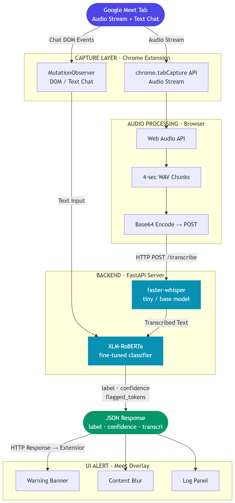
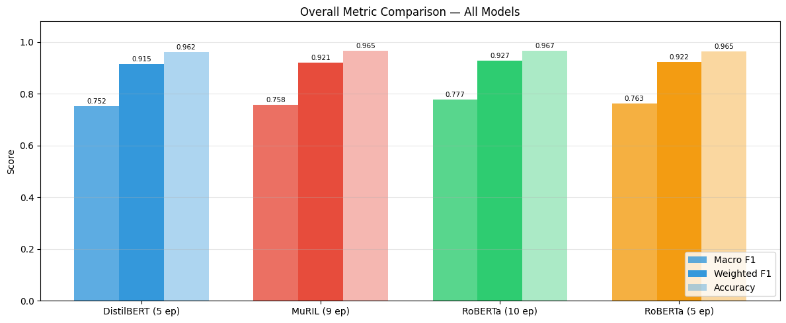
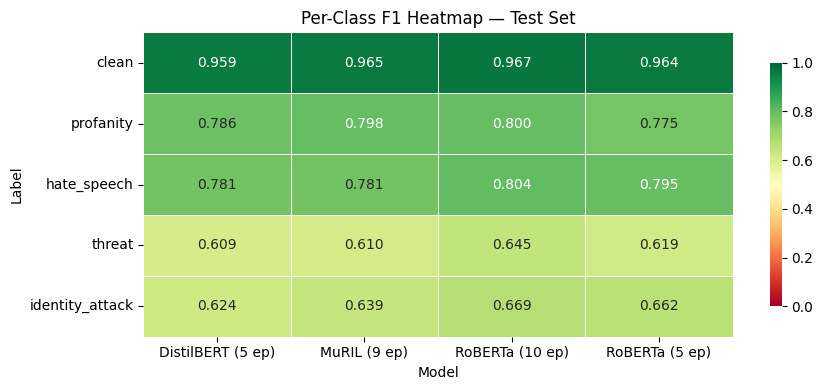
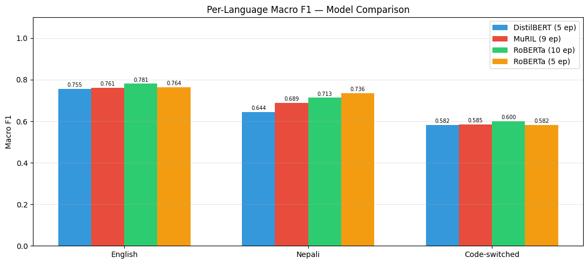
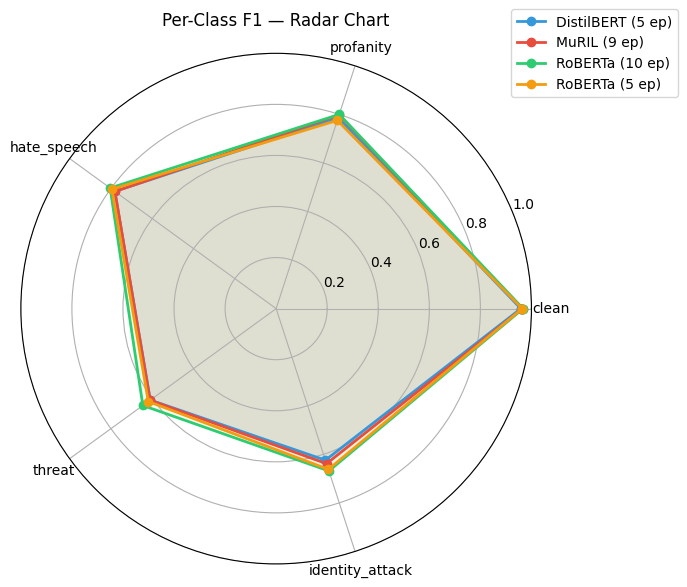
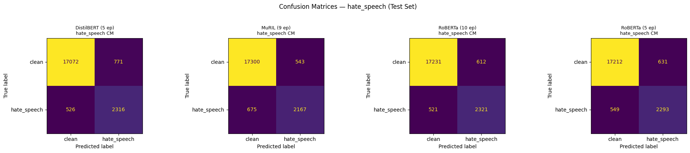

# Realtime Multilingual (English+Nepali) Hate Speech and Profanity Detection for Virtual Meetings and Classrooms

## Abstract
The rapid shift to virtual classrooms and online meetings has introduced new challenges in content moderation, particularly with the rise of hate speech and profanity in both text chat and live audio during these sessions. GuardMeet is a real-time AI-powered Chrome extension for Google Meet that automatically detects and flags inappropriate content. The system utilizes a two-stage pipeline: a faster-whisper model for near real-time speech-to-text transcription, and a fine-tuned multilingual transformer model (XLM-RoBERTa) for classification across five distinct categories: clean, profanity, hate_speech, threat, and identity_attack.

## Problem Statement
Current moderation tools are either manual, delayed, or completely absent. There is a critical need for an automated, real-time system capable of monitoring both text chat and live audio streams within a virtual meeting. GuardMeet is designed to transcribe live speech, classify speech and text across multiple toxic content categories, and alert the host immediately with non-intrusive visual indicators. It operates across English, Nepali, and code-switched utterances.

## System Architecture

GuardMeet operates as an integrated pipeline consisting of a frontend Chrome Extension and a local FastAPI backend.

1. **Chrome Extension (Frontend)**
   The extension captures live audio and chat from a Google Meet tab. It utilizes `chrome.tabCapture` and the Web Audio API via an offscreen document to chunk speech into 4-second WAV segments. Simultaneously, a MutationObserver extracts new chat messages. Both audio and text data streams are securely posted to the local backend. When the backend detects harmful content, the extension displays a warning banner and logs the entry for real-time moderation.

2. **FastAPI Server (Backend)**
   The backend is a modular FastAPI application that processes inference requests. It utilizes `faster-whisper` (CTranslate2, INT8 quantization) for near-instant, CPU-friendly transcription and Voice Activity Detection (VAD). The transcribed text and captured chat messages are then evaluated by a fine-tuned XLM-RoBERTa classification engine, which applies statistically derived sensitivity thresholds based on the detected language.

## Model Performance
The classification engine was trained on a diverse dataset of over 206,842 labeled sentences across English, Nepali, and Code-switched language domains. After comparative analysis against DistilBERT and MuRIL, the XLM-RoBERTa model (fine-tuned for 10 epochs) was selected as the optimal classifier.

### Key Metrics
* **Overall Macro F1:** 0.7770
* **Overall Weighted F1:** 0.9272
* **Overall Accuracy:** 96.72%
* **English Macro F1:** 0.7806
* **Nepali Macro F1:** 0.7361
* **Code-switched Macro F1:** 0.6000

### Evaluation Charts

#### Per-Class F1 Heatmap

#### Per-Language Macro F1

#### Radar Chart & Confusion Matrices

## Quick Setup Instructions

### Option 1: Download Pre-packaged Release (Recommended)
You can download the ready-to-use version of this project directly from the GitHub **Releases** page. 
1. Navigate to the **Releases** section on the right side of the GitHub repository.
2. Download the `release.zip` file.
3. Extract the contents, which will provide you with the clean `backend` and `extension` directories.

### Option 2: Clone Repository
Alternatively, you can clone the entire repository.

### 1. Start the Backend
You must have Python 3.10 or higher installed.

1. Open the `backend` directory.
2. Run the **`start_backend.bat`** file.

The script automatically creates a virtual environment, installs the required packages, downloads the fine-tuned Hate Speech model from Google Drive, and starts the FastAPI server. Please note that the first run will also automatically download the `faster-whisper` medium model weights natively.

### 2. Install the Chrome Extension
1. Open Google Chrome and navigate to `chrome://extensions/`.
2. Enable **Developer mode** in the top right corner.
3. Click **Load unpacked**.
4. Select the `extension` directory from this repository.

### 3. Usage
1. Open a Google Meet session.
2. Click the GuardMeet extension icon in your Chrome toolbar.
3. Click **Start Monitoring**.
4. Any flagged audio or chat messages will trigger a red alert overlay directly in your Meet window.

## Important Note
The `models` directory, which contains the heavy PyTorch `xlm-roberta` weights, and any generated audio files are intentionally excluded from version control to comply with repository size constraints. The provided batch script handles the download of these models automatically.
